# pix2pix-zero

### [**paper**](https://arxiv.org/abs/2302.03027) | [**website**](https://pix2pixzero.github.io/) | [**demo**](https://huggingface.co/spaces/pix2pix-zero-library/pix2pix-zero-demo) 
#### **Quick start:** [**Edit images**](#getting-started) | [**Gradio (locally hosted)**](#gradio-demo)

This is author's reimplementation of "Zero-shot Image-to-Image Translation" using the diffusers library. <br>
The results in the paper are based on the [CompVis](https://github.com/CompVis/stable-diffusion) library, which will be released later. 


**[New!]** Demo with ability to generate custom directions released on Hugging Face! <br>
**[New!]** Code for editing real and synthetic images released!


<br>
<div class="gif">
<p align="center">

</p>
</div>


We propose pix2pix-zero, a diffusion-based image-to-image approach that allows users to specify the edit direction on-the-fly (e.g., cat to dog). Our method can directly use pre-trained [Stable Diffusion](https://github.com/CompVis/stable-diffusion), for editing real and synthetic images while preserving the input image's structure. Our method is training-free and prompt-free, as it requires neither manual text prompting for each input image nor costly fine-tuning for each task.

**TL;DR**: no finetuning required, no text input needed, input structure preserved.

--- 

### Corresponding Manuscript
[Zero-shot Image-to-Image Translation](https://pix2pixzero.github.io/) <br>
[Gaurav Parmar](https://gauravparmar.com/),
[Krishna Kumar Singh](http://krsingh.cs.ucdavis.edu/),
[Richard Zhang](https://richzhang.github.io/),
[Yijun Li](https://yijunmaverick.github.io/),
[Jingwan Lu](https://research.adobe.com/person/jingwan-lu/),
[Jun-Yan Zhu](https://www.cs.cmu.edu/~junyanz/)<br>
CMU and  Adobe <br>
SIGGRAPH, 2023

---


## Results
All our results are based on [stable-diffusion-v1-4](https://github.com/CompVis/stable-diffusion) model. Please the website for more results.

<div>
<p align="center">
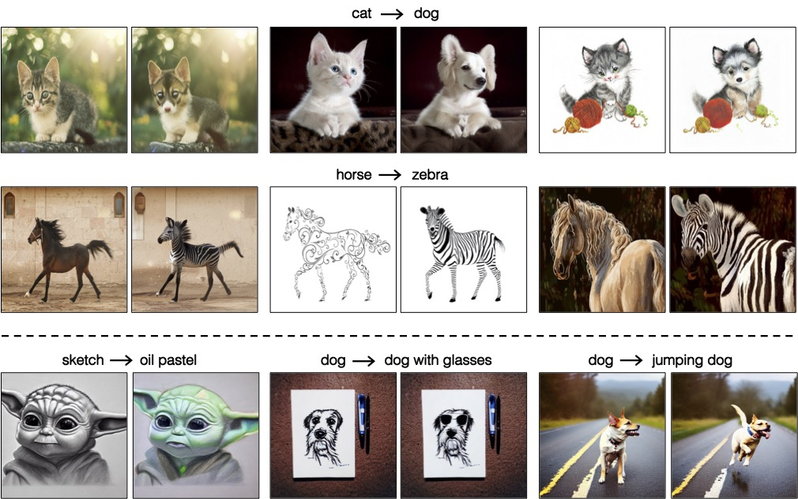
</p>
</div>
<hr>

The top row for each of the results below show editing of real images, and the bottom row shows synthetic image editing.
<div>
<p align="center">
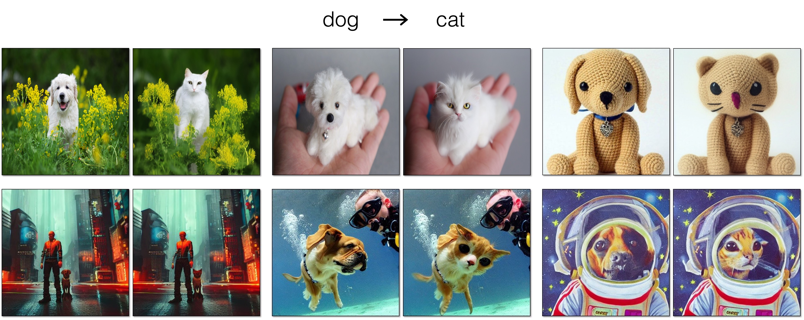
</p>

<p align="center">
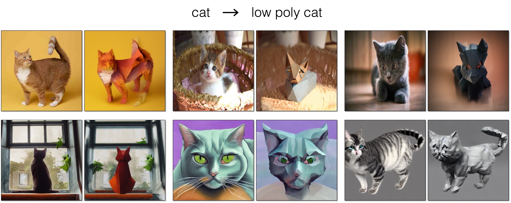
</p>
<p align="center">
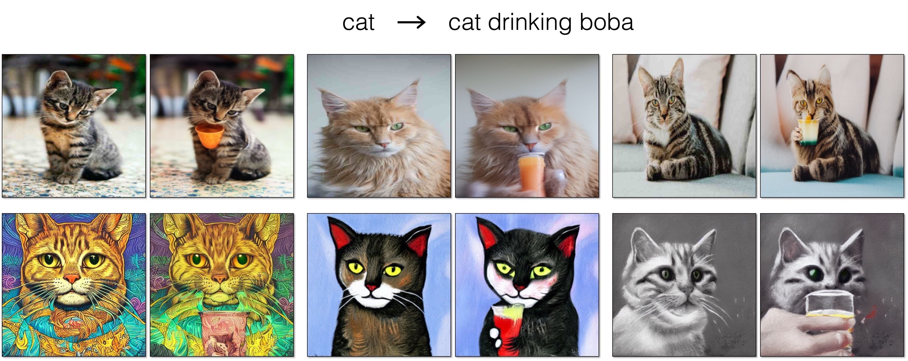
</p>
<p align="center">
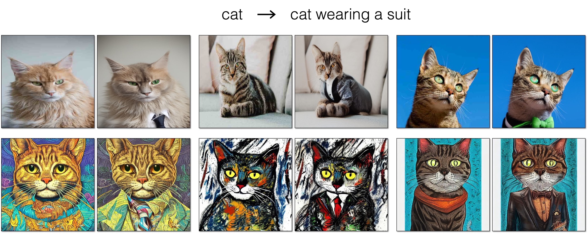
</p>
<p align="center">

</p>
<p align="center">
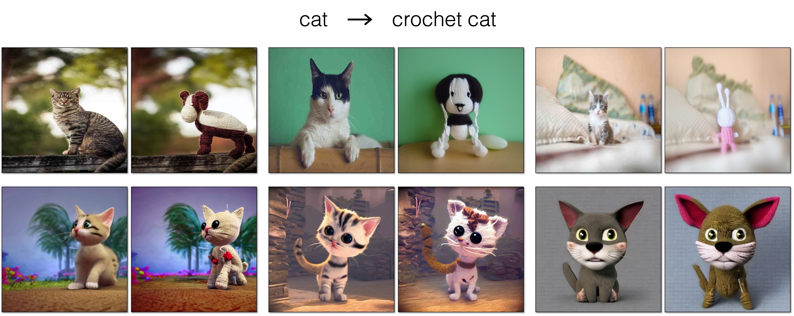
</p>

<p align="center">
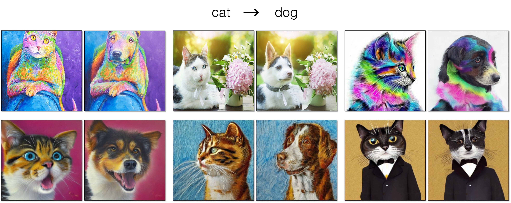
</p>

<p align="center">
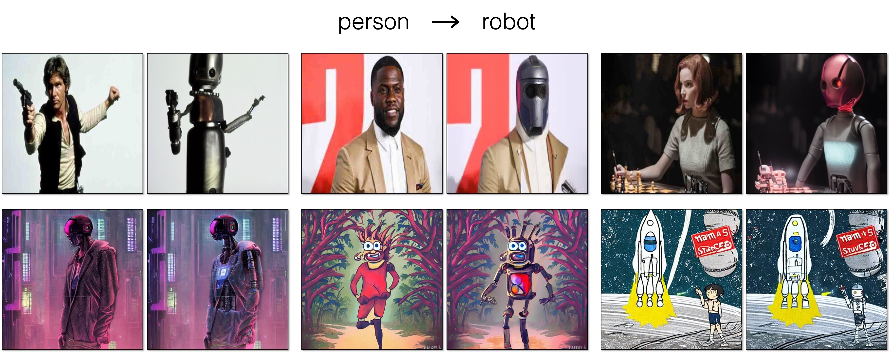
</p>


<p align="center">
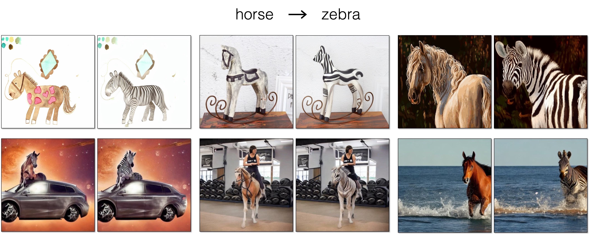
</p>
<p align="center">
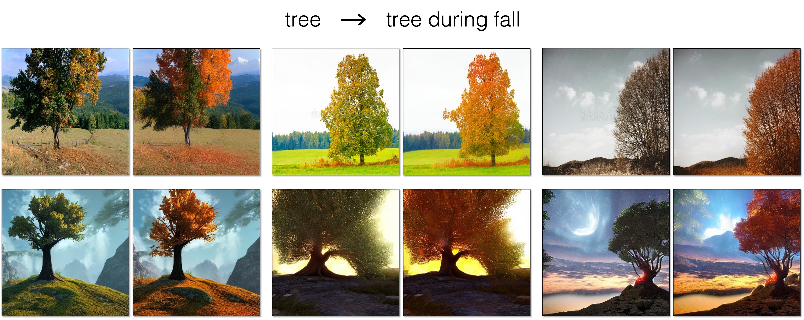
</p>
</div>

## Real Image Editing
<div>
<p align="center">
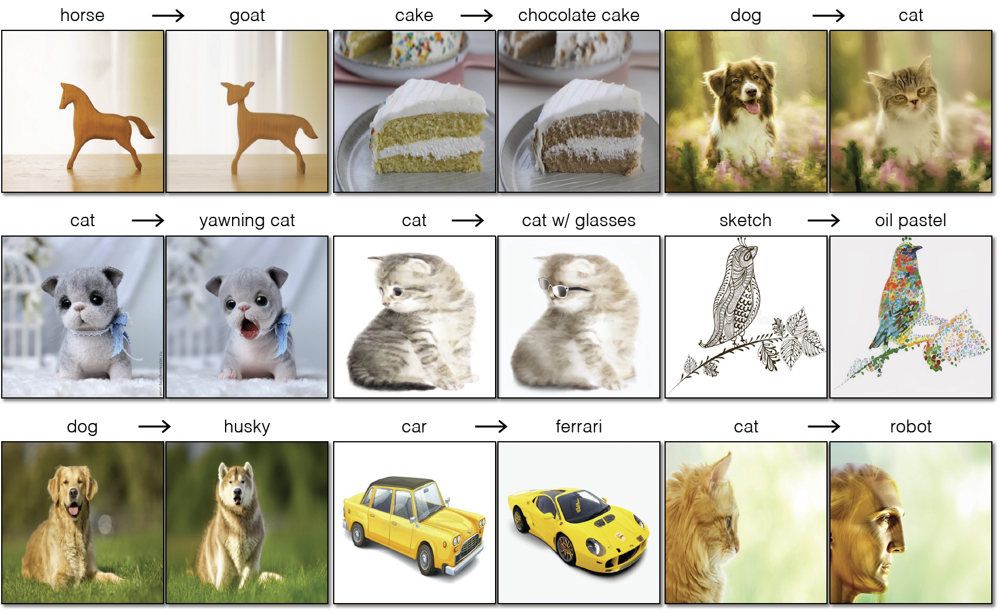
</p>
</div>

## Synthetic Image Editing
<div>
<p align="center">
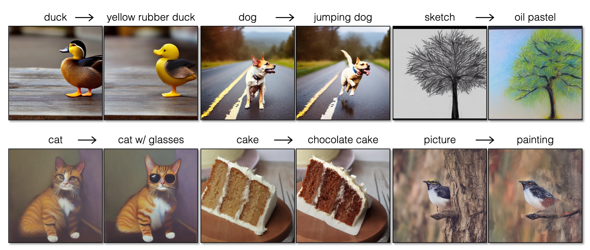
</p>
</div>

## Method Details

Given an input image, we first generate text captions using [BLIP](https://github.com/salesforce/LAVIS) and apply regularized DDIM inversion to obtain our inverted noise map.
Then, we obtain reference cross-attention maps that correspoind to the structure of the input image by denoising, guided with the CLIP embeddings 
of our generated text (c). Next, we denoise with edited text embeddings, while enforcing a loss to match current cross-attention maps with the 
reference cross-attention maps.

<div>
<p align="center">
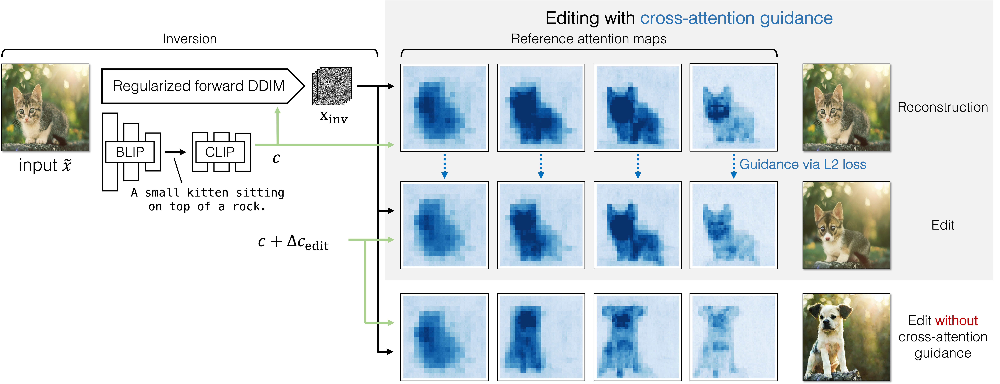
</p>
</div>


## Getting Started

**Environment Setup**
- We provide a [conda env file](environment.yml) that contains all the required dependencies
  ```
  conda env create -f environment.yml
  ```
- Following this, you can activate the conda environment with the command below. 
  ```
  conda activate pix2pix-zero
  ```

**Real Image Translation**
- First, run the inversion command below to obtain the input noise that reconstructs the image. 
  The command below will save the inversion in the results folder as `output/test_cat/inversion/cat_1.pt` 
  and the BLIP-generated prompt as `output/test_cat/prompt/cat_1.txt`
    ```
    python src/inversion.py  \
            --input_image "assets/test_images/cats/cat_1.png" \
            --results_folder "output/test_cat"
    ```
- Next, we can perform image editing with the editing direction as shown below.
  The command below will save the edited image as `output/test_cat/edit/cat_1.png`
    ```
    python src/edit_real.py \
        --inversion "output/test_cat/inversion/cat_1.pt" \
        --prompt "output/test_cat/prompt/cat_1.txt" \
        --task_name "cat2dog" \
        --results_folder "output/test_cat/" 
    ```

**Editing Synthetic Images**
- Similarly, we can edit the synthetic images generated by Stable Diffusion with the following command.
    ```
    python src/edit_synthetic.py \
        --results_folder "output/synth_editing" \
        --prompt_str "a high resolution painting of a cat in the style of van gogh" \
        --task "cat2dog"
    ```

### **Gradio demo**
- We also provide a UI for testing our method that is built with gradio. This demo also supports generating new directions on the fly! Running the following command in a terminal will launch the demo: 
    ```
    python app_gradio.py
    ```
- This demo is also hosted on HuggingFace [here](https://huggingface.co/spaces/pix2pix-zero-library/pix2pix-zero-demo).

### **Tips and Debugging**
  - **Controlling the Image Structure:**<br>
    The `--xa_guidance` flag controls the amount of cross-attention guidance to be applied when performing the edit. If the output edited image does not retain the structure from the input, increasing the value will typically address the issue. We recommend changing the value in increments of 0.05. 

  - **Improving Image Quality:**<br>
    If the output image quality is low or has some artifacts, using more steps for both the inversion and editing would be helpful. 
    This can be controlled with the `--num_ddim_steps` flag. 

  - **Reducing the VRAM Requirements:**<br>
    We can reduce the VRAM requirements using lower precision and setting the flag `--use_float_16`. 

<br>

**Finding Custom Edit Directions**<br>
 - We provide some pre-computed directions in the assets [folder](assets/embeddings_sd_1.4).
   To generate new edit directions, users can first generate two files containing a large number of sentences (~1000) and then run the command as shown below. 
    ```
      python src/make_edit_direction.py \
        --file_source_sentences sentences/apple.txt \
        --file_target_sentences sentences/orange.txt \
        --output_folder assets/embeddings_sd_1.4
    ```
- After running the above command, you can set the flag `--task apple2orange` for the new edit.


## Comparison
Comparisons with different baselines, including, SDEdit + word swap, DDIM + word swap, and prompt-to-propmt. Our method successfully applies the edit, while preserving the structure of the input image. 
<div>
<p align="center">
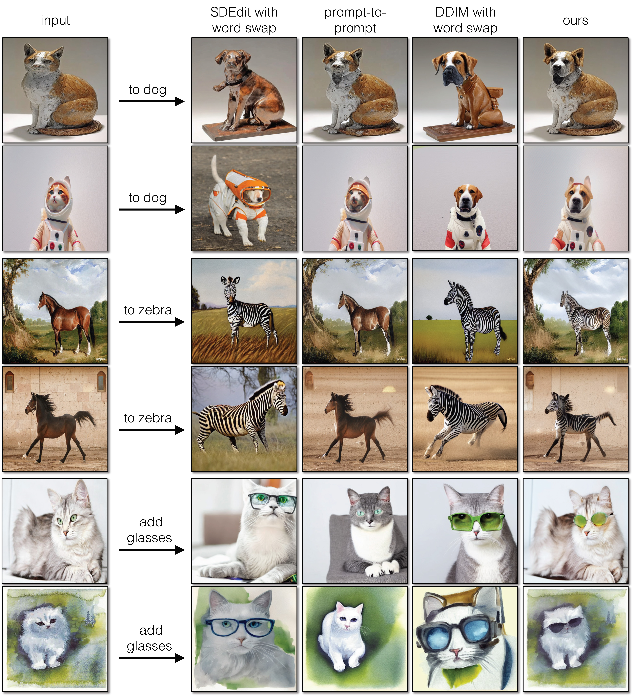
</p>
</div>


### Note:
The original implementation for the regularized DDIM Inversion had an implementation issue where the random roll would sometimes not get applied. Please see the updated code [here](https://github.com/pix2pixzero/pix2pix-zero/blob/main/src/utils/ddim_inv.py#L32) for the updated version.
