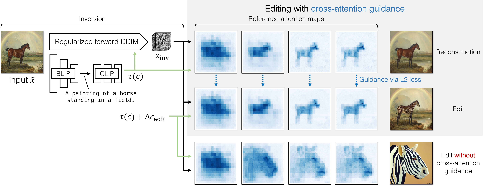

# pix2pix-zero [diffusers]

### [website](https://pix2pixzero.github.io/)

## Code and Demo coming soon

 

Our method, [pix2pix-zero](https://pix2pixzero.github.io/), enables the use of text-to-image diffusion models, such as [Stable Diffusion](https://github.com/CompVis/stable-diffusion), for editing images without the need for finetuning. This is achieved through cross-attention guidance during the sampling process, ensuring adherence of the output image's structure to the input. Additionally, our approach allows for the editing of images through pre-computed edit directions, eliminating the requirement for sentence modifications.

## Results
All our results are based on [stable-diffusion-v1-4](https://github.com/CompVis/stable-diffusion) model. Please the website for more results.

## Method Details

Given an input image, we first generate text captions using [BLIP](https://github.com/salesforce/LAVIS) and apply regularized DDIM inversion to obtain our inverted noise map.
Then, we obtain reference cross-attention maps that correspoind to the structure of the input image by denoising, guided with the CLIP embeddings 
of our generated text (c). Next, we denoise with edited text embeddings, while enforcing a loss to match current cross-attention maps with the 
reference cross-attention maps.

